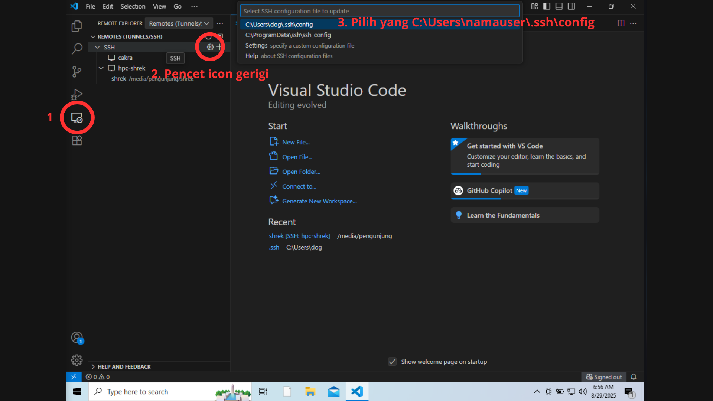
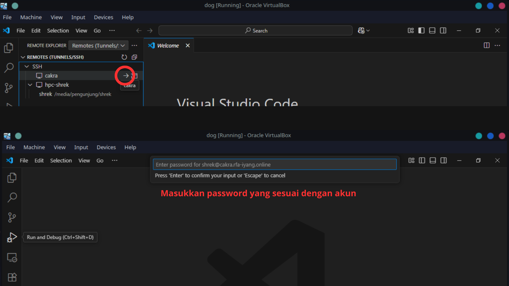
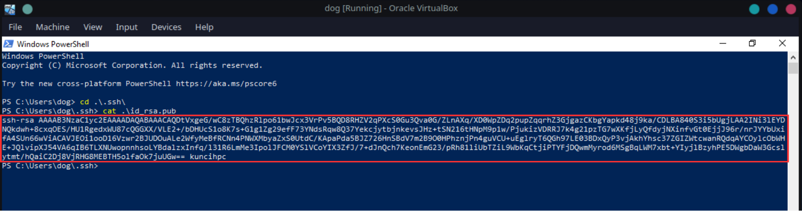
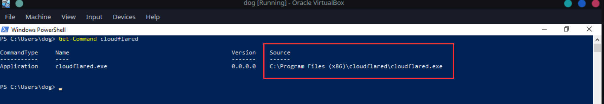

# 🚀 Tutorial: Masuk ke HPC **Cakra** lewat **VS Code** di **Windows**

Dokumen ini memandu kamu login SSH ke **HPC Cakra** langsung dari **Visual Studio Code (VS Code)** di Windows menggunakan ekstensi **Remote - SSH**. Disertai dua skenario koneksi: **langsung (IP kampus)** dan **melewati Cloudflare Access**.

---

## 🧭 Daftar Isi

- [📦 Prasyarat](#prasyarat)
- [🔑 Langkah 1: Membuat SSH Key](#membuat-ssh-key)
- [🧰 Langkah 2: Memasang VS Code & Ekstensi](#memasang-vs-code--ekstensi)
- [🔌 Login Cakra via SSH memakai Password](#login-cakra-via-ssh-memakai-password)
  - [Konfigurasi SSH (VS Code)](#langkah-1-konfigurasi-ssh)
  - [Masuk ke Cakra](#langkah-2-masuk-ke-cakra)
- [🔐 Login Cakra via SSH tanpa Password (SSH Key + Cloudflare)](#login-cakra-via-ssh-tanpa-password)
  - [Langkah 1: Kirim Public Key ke Cakra](#langkah-1-kirim-public-key-ke-cakra)
  - [Langkah 2: Memasang Cloudflare pada Windows](#langkah-2-memasang-cloudflare-pada-windows)
  - [Langkah 3: Konfigurasi SSH](#langkah-3-konfigurasi-ssh)
  - [Langkah 4: Tes Koneksi dari Terminal Windows](#langkah-4-tes-koneksi-dari-terminal-windows)
  - [Langkah 5: Connect dari VS Code (Remote - SSH)](#langkah-5-connect-dari-vs-code-remote---ssh)


---

## Prasyarat

* **VS Code** terpasang.
* Ekstensi **Remote - SSH** di VS Code.
* **(Opsional)** Akses **Cloudflare** jika koneksi eksternal lewat domain (mis. `cakra.rfa-iyang.online`).

> Info server Cakra yang umum dipakai:
>
> * **IP langsung/LAN/VPN**: `10.8.7.224`
> * **Domain Cloudflare**: `cakra.rfa-iyang.online`

## Membuat SSH Key
Buka powershell pada windows, lalu masukkan:

```powershell
ssh-keygen -t rsa -b 4096 -C "kuncicakra"
```

Tekan **Enter** terus untuk lokasi default: `C:\Users\<NamaUser>\.ssh\id_rsa` dan **passphrase** (opsional tapi disarankan).

---

---
## Memasang VS Code & Ekstensi
1. Pasang **VS Code** dari situs resmi.
2. Buka VS Code → **Extensions** → cari **Remote - SSH** (penerbit: *Microsoft*) → **Install**

---

# Login Cakra via SSH memakai Password

## Langkah 1: Konfigurasi SSH
Buka Visual Studio Code dan ikuti petunjuk angka berikut:


Jika sudah copy konfigurasi berikut ini dan sesuaikan username dan IdentityFile

```sshconfig
Host cakra
  User username
  HostName 10.8.7.224
```

## Langkah 2: Masuk ke Cakra
Didalam Visual Studio Code ikut petunjuk gambar ini:


# Login Cakra via SSH tanpa Password

## Langkah 1: Kirim Public Key ke Cakra
Buka Powershell dan masukkan susunan perintah berikut ini:

```powershell
cd .\.ssh\
cat .\id_rsa.pub
```

Salin hasil ``id_rsa.pub``. Contohnya pada gambar dibawah ini:


Hubungi managemen Cakra dengan mengirim email ke fkt ``fkt.um.fisika@gmail.com`` dengan format sebagai berikut:
```bash
Nama:
NIM:
username:
public key:
```

## Langkah 2: Memasang cloudflare pada windows
Buka tautan [cloudflare](https://developers.cloudflare.com/cloudflare-one/connections/connect-networks/downloads/) berikut ini. Ikuti petunjuk instalasi pada website cloudflare tersebut. Jika sudah terinstall cari ``path cloudflared.exe`` dengan memasukkan perintah berikut ini pada Powershell:
```powershell
Get-Command cloudflared
```


Didalam kotak merah tersebut ialah ``path cloudflared.exe`` yang akan digunakan untuk ``ProxyCommand`` pada saat konfigurasi SSH

## Langkah 3: Konfigurasi SSH
Buka Visual Studio Code dan buka konfigurasi ssh, lalu tambahkan konfigurasi berikut ini:

```sshconfig
Host hpc-cakra
  HostName cakra.rfa-iyang.online
  User username
  IdentityFile C:\Users\<NamaUser>\.ssh\id_rsa
  ProxyCommand "C:\\Program Files\\cloudflared\\cloudflared.exe" access ssh --hostname %h
  ServerAliveInterval 60
  ServerAliveCountMax 3
```
pada bagian ``ProxyCommand`` sesuaikan ``path`` dengan langkah 2

## Langkah 4: Tes Koneksi dari Terminal Windows

Sebelum masuk lewat VS Code, coba dari PowerShell:

```powershell
ssh hpc-cakra
```

Pada koneksi pertama, akan muncul pertanyaan **fingerprint host** → jawab `yes`.
Jika berhasil, kamu akan melihat shell di **Cakra** (contoh prompt `username@cakra:~$`). Ketik `exit` untuk keluar.


## Langkah 5: Connect dari VS Code (Remote - SSH)

1. Di VS Code → **Command Palette** (`Ctrl+Shift+P`).
2. Pilih **Remote-SSH: Connect to Host...** → pilih **`hpc-cakra`**.
3. Pilih jenis OS remote: **Linux**.
4. Tunggu VS Code memasang server komponen di remote (sekali saja). Jika diminta, pilih lokasi `~/.vscode-server` default.

Setelah terhubung, pojok kiri-bawah VS Code akan menampilkan **>< SSH: hpc-cakra**.
